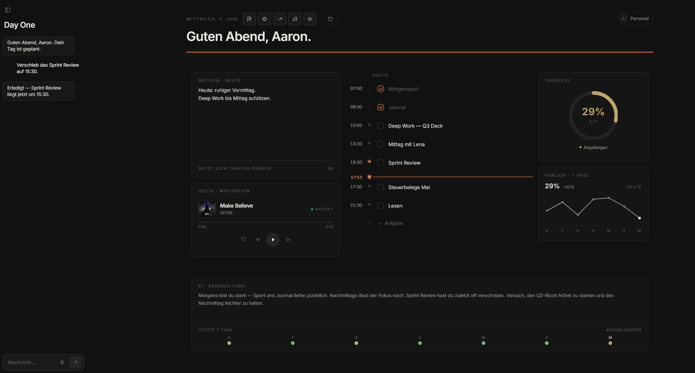

# Day One

Ein KI-gestützter Tagesplaner. Links chattest du mit der KI,
sie plant deinen Tag, die To-Do-Liste in der Mitte aktualisiert sich live. Jeden Tag
startest du frisch mit einer neuen To-Do Liste. Sie KI beobachtet deine Gewohnheiten und passt ihre Vorschläge an.



## Features

- **KI-Chat (gpt-4o)** [Kann durch Stärkere kostensufwändigere LLM Modelle: Claude Opus, etc. ersetzt werden] – legt Aufgaben an, hakt ab, ändert Notizen.
- **Spracheingabe** (Diktat) für den Chat.
- **To-Do-Timeline** mit Live-„Jetzt"-Linie, Inline-Bearbeiten, Drag-&-Drop-Widgets (Raster-Snap).
- **Täglicher Reset** um Mitternacht.
- **KI-Beobachtung / Habit-Tracker** – nach 7 Tagen Verhaltensanalyse, die in die Vorschläge zurückfließt.
- **Verlauf** – Aufgabentracking.
- **Motivationsmusik** via Jamendo (free/legal), mit Fallback.
- **Personal-Profil** – Name, Ziele, Routinen; die KI nutzt es als Kontext.

## Setup

1. **Node.js** installieren.
2. `.env` anlegen (Vorlage: `.env.example`) und API-Keys einsetzen:
   ```
   OPENAI_API_KEY=sk-...
   JAMENDO_CLIENT_ID=...        # optional, für Musik
   ```
   - OpenAI-Key: https://platform.openai.com/api-keys
   - Jamendo Client-ID (gratis): https://developer.jamendo.com
3. Server starten:
   ```
   node server/index.js
   ```
4. Im Browser öffnen: http://localhost:8771

## Aufbau

- `app/index.html` – komplette Frontend-App (React via CDN, Tailwind, react-grid-layout).
- `server/index.js` – schlanker Node-Server ohne Abhängigkeiten: liefert die App und
  proxyt `/api/chat`, `/api/observe`, `/api/music`.

## Hinweis

`.env` enthält private API-Keys und ist in `.gitignore` ausgeschlossen.
